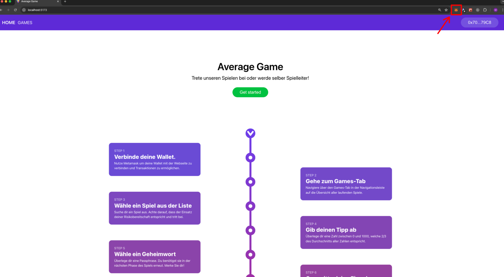
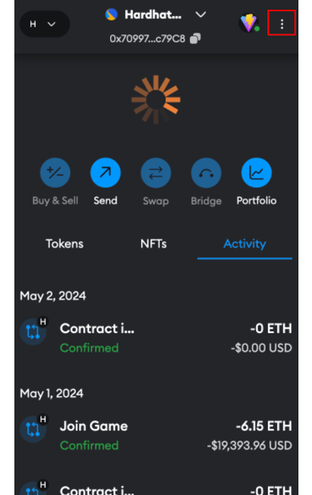
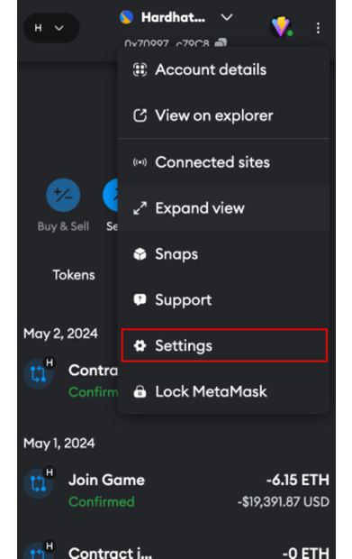
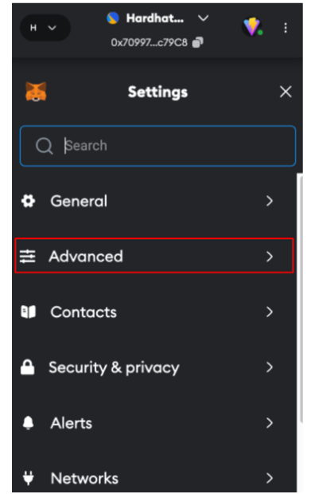

# Average Game

Dies ist das 2/3-Durchschnittspiel als Blockchain 3 Beleg.

## Installation

1. ##### Klonen Sie das Repository:

   ```bash
   git clone https://github.com/MauriceBonnesDev/average-game
   ```

2. ##### Wechseln Sie in das Projektverzeichnis:

   ```bash
   cd /pfad/zum/repository
   ```

3. ##### Wechseln Sie ins Backend

   ```bash
   cd backend
   ```

4. ##### Installieren Sie die Abhängigkeiten:

   ```bash
   npm install
   ```

5. ##### Wechseln Sie ins Frontend

   ```bash
   cd ../frontend
   ```

6. ##### Installieren Sie die Abhängigkeiten:

   ```bash
   npm install
   ```

## Starten der Applikation

1. ##### Starten des Frontends (in frontend Ordner):

   ```bash
   npm run dev
   ```

## Konfiguration

Standardmäßig ist das Projekt so konfiguriert, dass über das Sepolia-Testnet die Contracts angesprochen werden können.

#### AverageGameFactory Contract: 0x000

#### AverageGame Contract: 0x000

Um ein vereinfachtest Testen zu ermöglichen, gibt es die Möglichkeit, auf einer lokalen Blockchain von Hardhat umzuschalten. Hier ist die Blockzeit lediglich 2 Sekunden, was ein schnelleres Durchlaufen der Wartezeiten ermöglicht.

## Applikation in Hardhat starten

1. ##### Neues Terminalfenster im Projektverzeichnis starten

2. ##### Wechseln Sie ins Backend

   ```bash
   cd backend
   ```

3. ##### Lokale Blockchain starten

   ```bash
   npx hardhat node
   ```

   Dieses Terminalfenster muss dauerhaft geöffnet bleiben, da sonst die Blockchain nicht mehr läuft.

4. ##### Neues Terminalfenster im Projektverzeichnis starten

5. ##### Wechseln Sie ins Backend
   ```bash
   cd backend
   ```
6. ##### Smart Contracts lokal deployen

   ```bash
   ╰─ rm -rf ignition/deployments && npx hardhat ignition deploy ./ignition/modules/migration.ts --network localhost
   ```

   Hiermit werden zu erst alte deployte Contract Abis gelöscht und dann werden die neuen deployt.

7. ##### Wechseln Sie ins Frontend

   ```bash
   cd ../frontend
   ```

8. ##### Umbenennen der .json Dateien

   In `backend/ignition/deployments/chain-31337/artifacts` müssen die Dateien von

   ###

   `AverageGameModule#AverageGame.json` zu `AverageGameModule_AverageGame.json` und

   #####

   `AverageGameModule#AverageGameFactory.json` zu `AverageGameModule_AverageGameFactory.json`

   ###

   umbenannt werden.

   ###

   Das `#` kann von typechain nicht korrekt als String interpretiert werden, weswegen es durch ein `_` im Dateinamen ersetzt werden muss, bevor die Typen für Typescript erstellt werden können. Die .dbg.json Dateien können dabei ignoriert werden.

9. ##### Erstellen der Typescript Typen für die Contracts
   ```bash
   npx typechain --target=ethers-v6 "../backend/ignition/deployments/chain-31337/artifacts/AverageGameModule_*.json"
   ```

## Probleme in Hardhat

1. ##### Invalid Block Tag

   Sollte ein Problem auftreten, wobei in dem Terminalfenster der Blockchain eine ähnliche Meldung wie diese auftritt:
   `Received invalid block tag xx. Latest block number is zz`
   Dann sollten alle connecteten Wallets die Activity Data löschen, dann disconnecten und im Anschluss den Browser neu starten. Das kann passieren, da Metamask einen anderen Stand der Blockchain cached, welcher somit zurückgesetzt wird.

2. ##### Transaktionsnonce nicht synchron
   Wenn die lokale Blockchain genutzt wird, kann es sein, dass Metamask ein Problem damit hat, dass die Transaktionsnoncen nicht synchron mit der lokalen Blockchain sind. Dafür ist es notwendig, die Activity Data zu löschen, bevor eine Transaktion durchgeführt wird.

#### Activity Data in Metamask löschen

1. ##### Metamask öffnen
   
2. ##### Drei Punkte anklicken
   
3. ##### Settings öffnen
   
4. ##### Advanced öffnen
   
5. ##### Klicke auf Clear activity tab data
   

Diese Schritte für alle Wallets durchführen, die bisher eine Transaktion durchgeführt haben.
